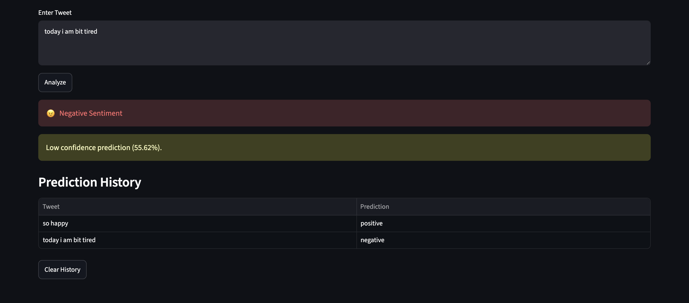
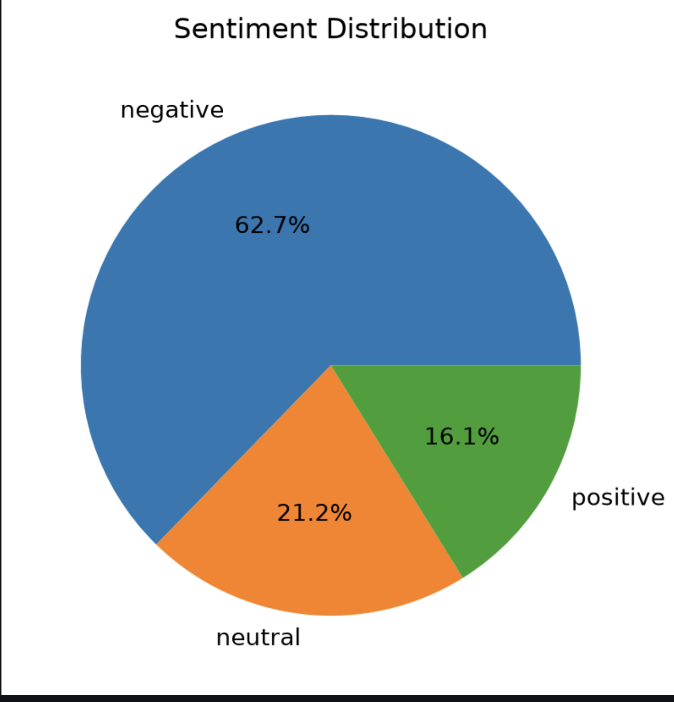
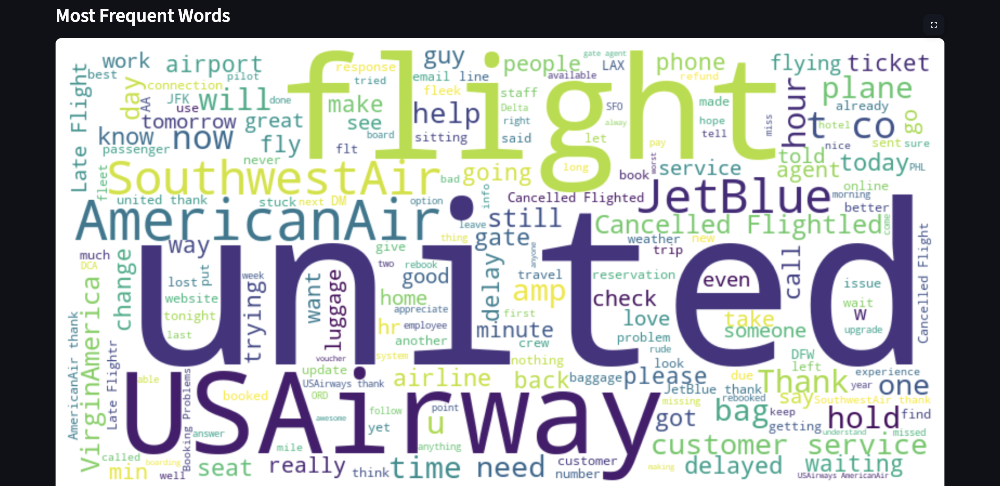

# 🐦 Twitter Sentiment Analysis Dashboard


## 📌 Project Overview

Twitter Sentiment Analysis Dashboard is a Machine Learning and Natural Language Processing (NLP) project that classifies tweets into **Positive**, **Negative**, or **Neutral** sentiments.

The project uses text preprocessing techniques, TF-IDF vectorization, and a Logistic Regression model to analyze tweet sentiment. An interactive Streamlit dashboard allows users to enter custom tweets and instantly receive sentiment predictions along with confidence scores.

---

## 📸 Dashboard Preview

### Main Dashboard


### Sentiment Prediction



### Sentiment Distribution



### Word Cloud



## 🚀 Features

✅ Tweet Sentiment Classification

✅ Positive, Negative, and Neutral Predictions

✅ Confidence Score Display

✅ Interactive Streamlit Dashboard

✅ Dataset Sentiment Analytics

✅ Sentiment Distribution Pie Chart

✅ Word Cloud Visualization

✅ Prediction History Tracking

✅ Text Preprocessing using NLP

✅ Batch CSV Prediction for tweet exports

---

## 🧠 Machine Learning Pipeline

### 1. Data Collection

Dataset Used:

**Twitter Airline Sentiment Dataset**

- Total Tweets: 14,640
- Sentiment Classes:
  - Positive
  - Neutral
  - Negative

---

### 2. Data Preprocessing

The tweet text undergoes:

- Lowercasing
- URL Removal
- Mention Removal (@user)
- Hashtag Removal (#)
- Punctuation Removal
- Stopword Removal
- Lemmatization using SpaCy

Example:

**Input:**

```text
@airline My flight was delayed again!!
```

**Output:**

```text
flight delay
```

---

### 3. Feature Extraction

TF-IDF Vectorization is used to convert text into numerical features.

```python
TfidfVectorizer(max_features=5000)
```

---

### 4. Model Training

Algorithm Used:

**Logistic Regression**

```python
LogisticRegression(max_iter=1000)
```

The model is trained on preprocessed tweets and saved using Pickle.

---

## 🏗️ Project Architecture

```text
Tweet Input
     │
     ▼
Text Preprocessing
     │
     ▼
TF-IDF Vectorization
     │
     ▼
Logistic Regression Model
     │
     ▼
Sentiment Prediction
     │
     ▼
Streamlit Dashboard
```

## Batch CSV Prediction

The dashboard can score multiple exported tweets from a CSV file. Upload a file
up to 2 MB and 5,000 rows with one of these text columns:

- `text`
- `tweet`
- `tweet_text`
- `full_text`
- `content`
- `body`

The app appends a `predicted_sentiment` column and lets you download the
annotated CSV.

---

## 📂 Project Structure

```text
twitter-sentiment-analysis/
│
├── app/
│   └── app.py
│
├── data/
│   └── Tweets.csv
│
├── models/
│   ├── sentiment_model.pkl
│   └── tfidf_vectorizer.pkl
│
├── notebooks/
│   └── EDA.ipynb
│
├── src/
│   ├── preprocess.py
│   ├── train_model.py
│   ├── predict.py
│   └── test_preprocess.py
│
├── assets/
│   ├── dashboard.png
│   └── prediction.png
│
├── requirements.txt
├── README.md
└── .gitignore
```

---

## 📊 Dashboard Components

### 📈 Sentiment Distribution

Displays the percentage of:

- Positive Tweets
- Neutral Tweets
- Negative Tweets

using a Pie Chart.

---

### ☁️ Word Cloud

Shows the most frequently occurring words in the dataset.

---

### 🔍 Real-Time Prediction

Users can enter any tweet and instantly obtain:

- Predicted Sentiment
- Confidence Score

---

### 📜 Prediction History

Stores previous predictions during the current session.

---

## 💻 Installation

### Clone Repository

```bash
git clone https://github.com/aarushi481/twitter-sentiment-analysis.git

cd twitter-sentiment-analysis
```

---

### Create Virtual Environment

#### Mac/Linux

```bash
python3 -m venv venv

source venv/bin/activate
```

#### Windows

```bash
python -m venv venv

venv\Scripts\activate
```

---

### Install Dependencies

```bash
pip install -r requirements.txt
```

---

## ▶️ Run Application

```bash
streamlit run app/app.py
```

Open:

```text
http://localhost:8501
```

---

## 🧪 Sample Predictions

| Tweet | Prediction |
|---------|------------|
| I love this airline service | Positive |
| My flight got cancelled again | Negative |
| Flight is scheduled for 8 PM | Neutral |

---

## 📚 Technologies Used

### Programming Language

- Python

### Libraries

- Pandas
- NumPy
- SpaCy
- Scikit-Learn
- Matplotlib
- WordCloud
- Streamlit
- Pickle

---

## 🎯 Learning Outcomes

Through this project, I learned:

- Natural Language Processing
- Text Cleaning Techniques
- TF-IDF Feature Extraction
- Machine Learning Model Training
- Logistic Regression
- Model Serialization using Pickle
- Data Visualization
- Streamlit Dashboard Development
- Git & GitHub Project Management

---

## 🔮 Future Enhancements

- BERT-based Sentiment Analysis
- Real-Time Twitter API Integration
- Interactive Analytics Dashboard
- Deep Learning Models (LSTM, Transformers)
- Cloud Deployment
- User Authentication

---

## 👩‍💻 Author

**Aarushi Goyal**

GitHub: https://github.com/aarushi481

---

## ⭐ Support

If you found this project useful, please consider giving it a ⭐ on GitHub.
